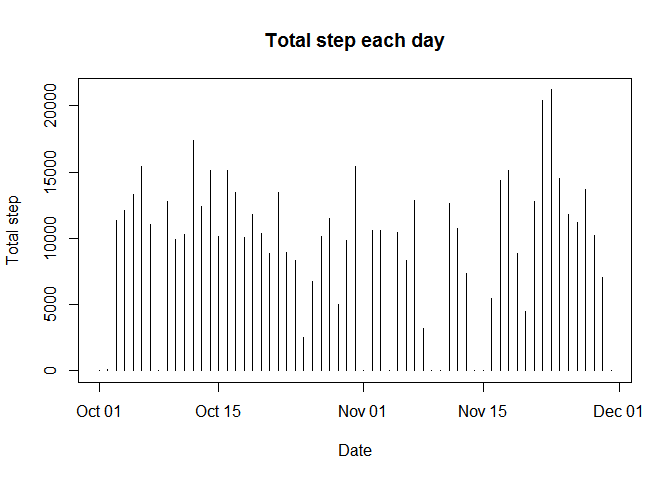
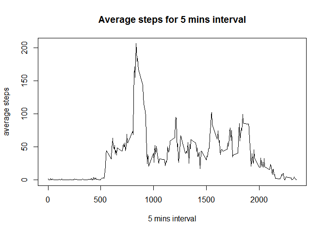
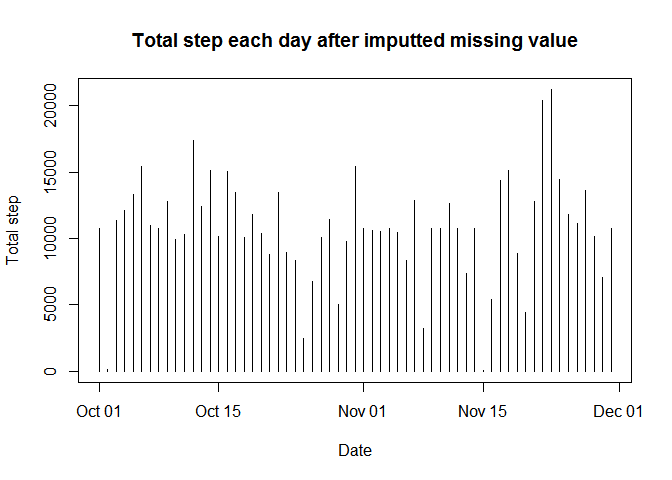
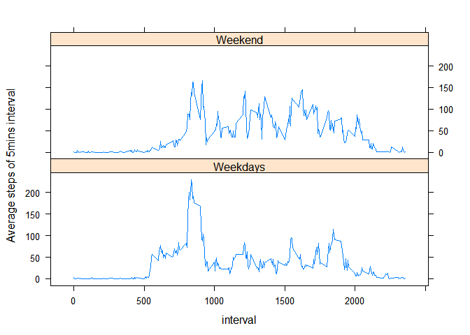

PA1\_Template.Rmd
================

Reproducible Research week 2 project
------------------------------------

Below is the required output of reproducible research week 2 project

1. set working directory and read csv file
==========================================

``` r
setwd("C:/Users/User/Desktop/Course/Data science specialization/Course 5 week 2")
f<-read.csv("./activity.csv", header = TRUE)
```

2. create a variable to store the table of date and Total\_step\_each\_day
==========================================================================

``` r
library("dplyr")
```

    ## Warning: package 'dplyr' was built under R version 3.3.3

    ## Warning: Installed Rcpp (0.12.8) different from Rcpp used to build dplyr (0.12.11).
    ## Please reinstall dplyr to avoid random crashes or undefined behavior.

    ## 
    ## Attaching package: 'dplyr'

    ## The following objects are masked from 'package:stats':
    ## 
    ##     filter, lag

    ## The following objects are masked from 'package:base':
    ## 
    ##     intersect, setdiff, setequal, union

``` r
ans2<-group_by(f, date) %>% summarize(Total_step_each_day = sum(steps, na.rm = TRUE))
print(ans2)
```

    ## # A tibble: 61 x 2
    ##          date Total_step_each_day
    ##        <fctr>               <int>
    ##  1 2012-10-01                   0
    ##  2 2012-10-02                 126
    ##  3 2012-10-03               11352
    ##  4 2012-10-04               12116
    ##  5 2012-10-05               13294
    ##  6 2012-10-06               15420
    ##  7 2012-10-07               11015
    ##  8 2012-10-08                   0
    ##  9 2012-10-09               12811
    ## 10 2012-10-10                9900
    ## # ... with 51 more rows

change the format of date from FACTOR to DATE, and plot histogram

``` r
ans2$date<-as.Date(as.character(ans2$date))
plot(x=ans2$date, y=ans2$Total_step_each_day, type="h", main = "Total step each day", xlab = "Date", ylab = "Total step")
```



3.calculate mean and median of each day
=======================================

``` r
ans3<-group_by(f, date) %>% summarize(Mean_each_day = mean(steps, na.rm = TRUE), Median_each_day = median(steps, na.rm = TRUE))
print(ans3)
```

    ## # A tibble: 61 x 3
    ##          date Mean_each_day Median_each_day
    ##        <fctr>         <dbl>           <dbl>
    ##  1 2012-10-01           NaN              NA
    ##  2 2012-10-02       0.43750               0
    ##  3 2012-10-03      39.41667               0
    ##  4 2012-10-04      42.06944               0
    ##  5 2012-10-05      46.15972               0
    ##  6 2012-10-06      53.54167               0
    ##  7 2012-10-07      38.24653               0
    ##  8 2012-10-08           NaN              NA
    ##  9 2012-10-09      44.48264               0
    ## 10 2012-10-10      34.37500               0
    ## # ... with 51 more rows

4.calcuate the average step of 5-mins interval and plot the graph
=================================================================

``` r
ans4<-group_by(f,interval) %>% summarize(five_mins_avg = mean(steps, na.rm = TRUE))
```

Plot the graph

``` r
plot(x = ans4$interval, y = ans4$five_mins_avg, main = "Average steps for 5 mins interval", xlab = "5 mins interval", ylab = "average steps", type = "l")
```



5. Find the highest average of step of 5 mins interval
======================================================

``` r
ans5<-subset(ans4, five_mins_avg == max(five_mins_avg))
print(ans5)
```

    ## # A tibble: 1 x 2
    ##   interval five_mins_avg
    ##      <int>         <dbl>
    ## 1      835      206.1698

6. Missing value is imputted by its average steps across days
=============================================================

``` r
ans6<-merge(x = f, y = ans4, intersect(names(f), names(ans4)))
ans6$steps[is.na(ans6$steps)]<-ans6$five_mins_avg[is.na(ans6$steps)]
ans6<-arrange(ans6, date, interval)
print(head(ans6,50))
```

    ##    interval     steps       date five_mins_avg
    ## 1         0 1.7169811 2012-10-01     1.7169811
    ## 2         5 0.3396226 2012-10-01     0.3396226
    ## 3        10 0.1320755 2012-10-01     0.1320755
    ## 4        15 0.1509434 2012-10-01     0.1509434
    ## 5        20 0.0754717 2012-10-01     0.0754717
    ## 6        25 2.0943396 2012-10-01     2.0943396
    ## 7        30 0.5283019 2012-10-01     0.5283019
    ## 8        35 0.8679245 2012-10-01     0.8679245
    ## 9        40 0.0000000 2012-10-01     0.0000000
    ## 10       45 1.4716981 2012-10-01     1.4716981
    ## 11       50 0.3018868 2012-10-01     0.3018868
    ## 12       55 0.1320755 2012-10-01     0.1320755
    ## 13      100 0.3207547 2012-10-01     0.3207547
    ## 14      105 0.6792453 2012-10-01     0.6792453
    ## 15      110 0.1509434 2012-10-01     0.1509434
    ## 16      115 0.3396226 2012-10-01     0.3396226
    ## 17      120 0.0000000 2012-10-01     0.0000000
    ## 18      125 1.1132075 2012-10-01     1.1132075
    ## 19      130 1.8301887 2012-10-01     1.8301887
    ## 20      135 0.1698113 2012-10-01     0.1698113
    ## 21      140 0.1698113 2012-10-01     0.1698113
    ## 22      145 0.3773585 2012-10-01     0.3773585
    ## 23      150 0.2641509 2012-10-01     0.2641509
    ## 24      155 0.0000000 2012-10-01     0.0000000
    ## 25      200 0.0000000 2012-10-01     0.0000000
    ## 26      205 0.0000000 2012-10-01     0.0000000
    ## 27      210 1.1320755 2012-10-01     1.1320755
    ## 28      215 0.0000000 2012-10-01     0.0000000
    ## 29      220 0.0000000 2012-10-01     0.0000000
    ## 30      225 0.1320755 2012-10-01     0.1320755
    ## 31      230 0.0000000 2012-10-01     0.0000000
    ## 32      235 0.2264151 2012-10-01     0.2264151
    ## 33      240 0.0000000 2012-10-01     0.0000000
    ## 34      245 0.0000000 2012-10-01     0.0000000
    ## 35      250 1.5471698 2012-10-01     1.5471698
    ## 36      255 0.9433962 2012-10-01     0.9433962
    ## 37      300 0.0000000 2012-10-01     0.0000000
    ## 38      305 0.0000000 2012-10-01     0.0000000
    ## 39      310 0.0000000 2012-10-01     0.0000000
    ## 40      315 0.0000000 2012-10-01     0.0000000
    ## 41      320 0.2075472 2012-10-01     0.2075472
    ## 42      325 0.6226415 2012-10-01     0.6226415
    ## 43      330 1.6226415 2012-10-01     1.6226415
    ## 44      335 0.5849057 2012-10-01     0.5849057
    ## 45      340 0.4905660 2012-10-01     0.4905660
    ## 46      345 0.0754717 2012-10-01     0.0754717
    ## 47      350 0.0000000 2012-10-01     0.0000000
    ## 48      355 0.0000000 2012-10-01     0.0000000
    ## 49      400 1.1886792 2012-10-01     1.1886792
    ## 50      405 0.9433962 2012-10-01     0.9433962

7. Plot histogram of the total number of steps taken each day after missing values are imputed
==============================================================================================

``` r
ans7<-group_by(ans6, date) %>% summarize(Total_step_each_day = sum(steps, na.rm = TRUE))
ans7$date<-as.Date(as.character(ans7$date))
print(ans7)
```

    ## # A tibble: 61 x 2
    ##          date Total_step_each_day
    ##        <date>               <dbl>
    ##  1 2012-10-01            10766.19
    ##  2 2012-10-02              126.00
    ##  3 2012-10-03            11352.00
    ##  4 2012-10-04            12116.00
    ##  5 2012-10-05            13294.00
    ##  6 2012-10-06            15420.00
    ##  7 2012-10-07            11015.00
    ##  8 2012-10-08            10766.19
    ##  9 2012-10-09            12811.00
    ## 10 2012-10-10             9900.00
    ## # ... with 51 more rows

Plot the graph

``` r
plot(x=ans7$date, y=ans7$Total_step_each_day, type="h", main = "Total step each day after imputted missing value", xlab = "Date", ylab = "Total step")
```



8. Create weekend and weekday for weektype (factor)
===================================================

``` r
weektype<-weekdays(as.Date(as.character(ans6$date))) %in% c("Saturday", "Sunday")
weektype[weektype==TRUE]<-"Weekend"
weektype[weektype==FALSE]<-"Weekdays"
weektype<-as.factor(weektype)
ans8<-cbind(ans6, weektype)
```

calculate the mean by weektype factor

``` r
ans8<-group_by(ans8,interval, weektype) %>% summarize(five_mins_avg = mean(steps, na.rm = TRUE))
ans8
```

    ## # A tibble: 576 x 3
    ## # Groups:   interval [?]
    ##    interval weektype five_mins_avg
    ##       <int>   <fctr>         <dbl>
    ##  1        0 Weekdays   2.251153040
    ##  2        0  Weekend   0.214622642
    ##  3        5 Weekdays   0.445283019
    ##  4        5  Weekend   0.042452830
    ##  5       10 Weekdays   0.173165618
    ##  6       10  Weekend   0.016509434
    ##  7       15 Weekdays   0.197903564
    ##  8       15  Weekend   0.018867925
    ##  9       20 Weekdays   0.098951782
    ## 10       20  Weekend   0.009433962
    ## # ... with 566 more rows

load library lattice to plot histogram by factor weektype

``` r
library("lattice")
xyplot(five_mins_avg ~ interval | weektype, data = ans8, layout = c(1,2), type = "l", ylab = "Average steps of 5mins interval")
```


